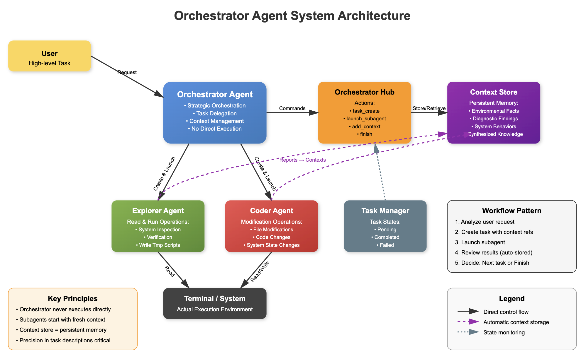
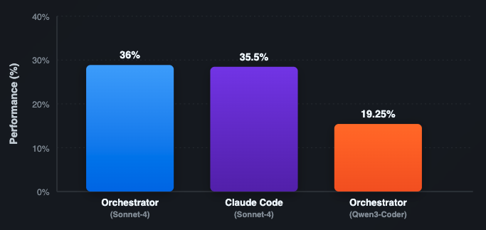

# 🤓 Orchestrator: A multi-agent AI coder. Now #12 on Stanford's TerminalBench. Open sourced!

TL;DR:
- Over the weekend, quite unexpectedly, I made a multi-agent AI system that places slightly higher than Claude Code on Stanford's TerminalBench leaderboard (12th place).
- This AI system consists of an orchestration agent that dispatches multiple explorer and coder agents to do all the work.
- The orchestrator explicitly defines what knowledge artifacts subagents must return, then reuses and synthesises these artifacts across future tasks - creating compound intelligence where each action builds meaningfully on previous discoveries.

## How the System Works



The orchestrator acts as the brain of the operation - it receives the user's task but never touches code directly. Instead, it:

1. **Analyses** the task and breaks it into focused subtasks
2. **Dispatches** explorer agents to understand the system
3. **Delegates** implementation work to coder agents with precise instructions
4. **Verifies** all changes through additional explorer agents
5. **Maintains** the context store with all discovered knowledge

The orchestrator's lack of direct code access forces proper delegation and verification patterns, leading to more strategic solutions.

For a full breakdown of this project's code structure, see [here](./PROJECT_STRUCTURE.md)


## 📈 Evaluation Results

### Performance on TerminalBench

[Terminal bench](https://www.tbench.ai/) is a brilliant benchmark created by Stanford and [Laude Institute](https://www.laude.org/) to quantify agents' ability to complete complex tasks in the terminal. My Orchestrator system achieved **12th place** on the leaderboard, demonstrating competitive performance against leading AI coding assistants.

I ran the Orchestrator evaluations with both Claude-4-Sonnet and also Qwen3-Coder-480B-A35B:



### Cost & Efficiency

One of the most striking results is the amount of tokens used by Sonnet-4 as opposed to Qwen3-Coder.

The below table shows the total tokens (input and output included) processed across the TerminalBench evaluation run (5 attempts at 80 tasks = 400 trajectories).

| Model | Success Rate | Total Evaluation Cost | Token Usage |
|-------|--------------|------------|-------------|
| **Claude Sonnet-4** | 36.0% | $263.56* | 93.2M tokens |
| **Qwen-3-Coder** | 19.25% | $217.83 | 14.7M tokens |

*Claude Sonnet-4 costs reflect heavy caching usage, reducing actual API costs


## 🤖 The Agents

While all agents use the same underlying LLM, each operates with its own context window, specialised system message, and distinct toolset. This creates functionally different agents optimised for their specific roles.

### 🎯 Orchestrator Agent
[System message](./src/agents/system_msgs/md_files/orchestrator_sys_msg_v0.1.md)
**Role:** Strategic coordinator and persistent intelligence layer  
**Capabilities:** Task decomposition, context management, subagent delegation  
**Tools:** Task creation, subagent launching, context store management  
**Restrictions:** Cannot read or modify code directly - operates purely at architectural level  

The orchestrator maintains the complete picture across all tasks, tracking discoveries and progress. It crafts precise task descriptions that explicitly specify what contexts subagents should return, ensuring focused and valuable information gathering.

**Trust Calibration Strategy:**  
The orchestrator employs adaptive delegation based on task complexity:
- **Low Complexity Tasks**: Grants extremely high autonomy to the coder agent for simple modifications and bug fixes
- **Medium/Large Tasks**: Maintains strong trust but uses iterative decomposition - breaking complex problems into atomic, verifiable steps
- **Verification Philosophy**: Uses explorer agents liberally to verify progress, especially when tasks involve critical functionality


### 🔍 Explorer Agent 
[System message](./src/agents/system_msgs/md_files/explorer_sys_msg_v0.1.md) 
**Role:** Read-only investigation and verification specialist  
**Capabilities:** System exploration, code analysis, test execution, verification  
**Tools:** File reading, search operations (grep/glob), bash commands, temporary script creation  
**Restrictions:** Cannot modify existing files - strictly read-only operations  

Explorers gather intelligence about the codebase, verify implementations, and discover system behaviors. They create knowledge artifacts that eliminate redundant exploration for future agents.

### 💻 Coder Agent
[System message](./src/agents/system_msgs/md_files/coder_sys_msg_v0.1.md)
**Role:** Implementation specialist with write access  
**Capabilities:** Code creation/modification, refactoring, bug fixes, system changes  
**Tools:** Full file operations (read/write/edit), bash commands, search operations  
**Restrictions:** None - full system access for implementation tasks  

Coders transform architectural vision into working code. They receive focused tasks with relevant contexts and implement solutions while maintaining code quality and conventions.

## Key System Components

### 🧠 Smart Context Sharing

#### How Context Sharing Works

I introduced a novel approach to multi-agent coordination through the **Context Store** - a persistent knowledge layer that transforms isolated agent actions into coherent problem-solving. Unlike traditional multi-agent systems where agents operate in isolation, my architecture enables sophisticated knowledge accumulation and sharing.

**The Context Store Pattern:**
1. **Orchestrator-Directed Discovery**: The orchestrator explicitly specifies what contexts it needs from each subagent, ensuring focused and relevant information gathering and implementation reporting
2. **Knowledge Artifacts**: Subagents create discrete, reusable context items based on the orchestrator's requirements
3. **Persistent Memory**: Contexts persist across agent interactions, building a comprehensive system understanding
4. **Selective Injection**: The orchestrator precisely injects relevant contexts into new tasks, eliminating redundant discovery and providing all the information a subagent needs to complete it's respective task
5. **Compound Intelligence**: Each action builds meaningfully on previous discoveries, creating exponential problem-solving capability

**Key Benefits:**
- **Eliminates Redundant Work**: Subagents never need to rediscover the same information twice
- **Reduces Context Window Load**: Agents receive only the specific contexts they need
- **Enables Complex Solutions**: Multi-step problems that no single agent could solve become tractable
- **Maintains Focus**: Each subagent operates with a clean, focused context window

This architecture ensures that every piece of discovered information becomes a permanent building block for future tasks, creating a system that genuinely learns and adapts throughout the problem-solving process.

### 📋 Task Management

The orchestrator maintains a comprehensive task management system that tracks all subagent activities:

**Core Functions:**
- **Progress Tracking**: Monitors task status (pending, completed, failed) across potentially hundreds of coordinated actions
- **Failure Recovery**: Captures failure reasons to enable strategic adaptation and intelligent retries
- **Workflow Orchestration**: Maintains clear audit trails of what's been attempted, preventing redundant work
- **Strategic Planning**: Enables systematic decomposition of complex problems into verifiable subtasks

The task manager serves as the orchestrator's operational memory - while the context store holds discovered knowledge, the task manager tracks the journey of discovery itself. This dual-layer system ensures the orchestrator always knows both what it has learned AND how it learned it, enabling sophisticated multi-step solutions that build intelligently on previous attempts.

### ⏱️ Time-Conscious Orchestration

One thing I noticed during early evaluations was that whilst the system was on track to complete extremely complex tasks, it would use lots of subagents to get there, and therefore the task would time out.

 Therefore the orchestrator now employs a philosophy for time-efficient execution, recognising that wasted time often stems from poor task specification rather than slow execution:

**Prevention Principles:**
- **Front-Loading Precision**: The orchestrator spends time crafting exact task descriptions rather than iterating on vague ones
- **Context Completeness**: Always over-provides context rather than under-providing, preventing subagents from rediscovering known information
- **Explicit Expectations**: Every task specifies exactly what contexts should be returned, eliminating unfocused exploration
- **Tight Scoping**: Defines clear boundaries - what to do AND what not to do, preventing scope creep


## Getting started

For dev:
```bash
uv sync
```

To run evals:
```bash
./run_terminal_bench_eval.sh
```

To quickly test various models: See [/tests](./tests/)